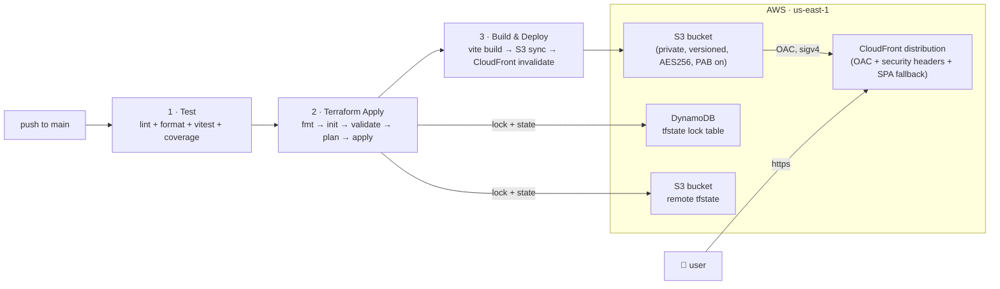

# Atlas — Post-midsem walkthrough

This is the deeper, phase-by-phase note for what changed in Atlas after the
midsem review. Pre-midsem the app was a Vite SPA deployed manually to Vercel
and GitHub Pages. Post-midsem the deploy path is a chained CI/CD pipeline that
provisions its own AWS infrastructure with Terraform and ships every push to
`main` to a private S3 bucket fronted by CloudFront — fully gated behind a
single repo variable so unconfigured forks stay green.

For the rubric mapping (what proves each requirement), see
[SUBMISSION.md](SUBMISSION.md).

---

## At a glance

Atlas is a static SPA, so the AWS footprint is intentionally tiny —
**S3 + CloudFront** instead of the ECS-Fargate-plus-RDS pattern a full-stack
app needs. That's the whole point: pick the cheapest sufficient architecture
and harden it.

---

## Phase 0 · Pre-commit hardening + secret scanning

**Goal:** stop bad commits at the laptop, and stop secrets from ever reaching
GitHub.

What landed:

- Husky + lint-staged (`solid-colour/package.json` → `lint-staged` block) so
  every staged file is run through Prettier before the commit lands.
- A root-level `.pre-commit-config.yaml` with the standard pre-commit hooks
  (`trailing-whitespace`, `end-of-file-fixer`, `check-yaml`,
  `check-added-large-files`) for anything edited outside `solid-colour/`.
- [`secret-scan.yml`](.github/workflows/secret-scan.yml) runs **gitleaks**
  across the full git history on every push, every PR, and a weekly cron.
  Permissions are scoped to `contents: read`.
- [`codeql.yml`](.github/workflows/codeql.yml) runs the
  `security-and-quality` query pack on push, PR, and a weekly cron.

Commits that introduced this:

- `8f97001` replace the old colour-fun e2e suite with the Stax smoke spec
- `c7c059f` secret-scan: weekly cron and tighter permissions
- `26fd36b` wire up CodeQL with the security-and-quality query pack

**Cost:** $0. All three run on GitHub-hosted runners and stay well inside the
public-repo Actions free tier.

---

## Phase 1 · Real test pipeline (coverage + JUnit + e2e)

**Goal:** every PR gets the same checks production gets.

What landed:

- Vitest with **v8 coverage** + a **JUnit reporter** (centralized in
  `solid-colour/vitest.config.ts`) so CI picks up structured test results
  instead of raw stdout.
- `npm run test:ci` runs vitest with coverage and writes it to
  `solid-colour/coverage/`. The JUnit reporter activates whenever `CI=true`
  is set (GitHub Actions sets this automatically), via the conditional in
  `vitest.config.ts`.
- Playwright e2e in [`solid-colour/e2e/smoke.spec.ts`](solid-colour/e2e/smoke.spec.ts) — a small smoke
  spec that boots `vite preview` in CI (and `vite dev` locally), checks the
  title, mounts the root, and asserts no console errors.
- [`tests.yml`](.github/workflows/tests.yml) is split into focused jobs
  (lint+format, vitest with coverage+junit, vite build, playwright e2e,
  hadolint) with concurrency + timeouts and a single `ci-success` aggregator
  job. Branch protection requires `CI success` instead of N individual jobs.
- ESLint runs with `--max-warnings 0` so warnings fail the build.

Commits that introduced this:

- `28646ca` move vitest reporters and coverage into the config; fail lint on any warning
- `cb9daa0` tests.yml cleanup: split into focused jobs, add concurrency + timeouts, run e2e against vite preview, lint the dockerfile, and add a single ci-success check for branch protection

**Cost:** $0 (public-repo Actions minutes).

---

## Phase 2a · Production-grade container

**Goal:** ship the SPA in a hardened nginx container that runs as a non-root
user on a read-only filesystem.

What landed:

- Multi-stage [`solid-colour/Dockerfile`](solid-colour/Dockerfile): a Node
  builder stage runs `npm ci && npm run build`, then a nginx-alpine stage
  serves `dist/` with a custom `nginx.conf`. Final image is small and has no
  Node toolchain in it.
- The runtime base is **`nginxinc/nginx-unprivileged:1.27-alpine`** so the
  container runs as the `nginx` user with no `CAP_NET_BIND_SERVICE`, listening
  on port 8080 (not 80).
- [`solid-colour/nginx.conf`](solid-colour/nginx.conf) adds:
  - SPA fallback (`try_files $uri $uri/ /index.html`)
  - Long, immutable cache for hashed Vite assets
  - `no-cache` for `sw.js` (service workers must update fast)
  - Real security headers — X-Frame-Options, X-Content-Type-Options,
    Referrer-Policy, Permissions-Policy, baseline CSP
  - gzip
- [`docker-compose.yml`](docker-compose.yml) at repo root locks down the
  runtime: `read_only: true`, scoped tmpfs mounts for `/tmp`, `/var/cache/nginx`,
  `/var/run`, `cap_drop: ALL` (only required caps re-added),
  `security_opt: no-new-privileges:true`.
- Hadolint runs against the Dockerfile in CI.

Commits that introduced this:

- `938c4c5` multi-stage Dockerfile for solid-colour (node builder -> nginx alpine)
- `b194833` nginx config with SPA fallback, long cache for assets, no cache for sw.js
- `4a669e9` docker-compose for local dev and render.yaml for the PaaS deploy
- `bc5b749` switch the nginx base to nginx-unprivileged so the container runs as a non-root user
- `1ee43b2` nginx: add real security headers (frame, content-type, referrer, permissions, CSP)
- `2ee0ec0` compose: read-only filesystem, drop all caps, no-new-privileges

**Cost:** $0 — local dev only at this stage. Hardening pays off once this
image runs in production.

---

## Phase 2b / 3 · Terraform infrastructure

**Goal:** the production environment is described entirely in code, with
remote state and a state lock, in the cheapest configuration that hosts a
hardened SPA.

What landed in [`infra/`](infra/):

- [`backend.tf`](infra/backend.tf) — S3 remote state + DynamoDB state lock
  (`atlas-tfstate-locks`). Bootstrap commands are documented inline.
- [`providers.tf`](infra/providers.tf) — pinned `~> 5.60` AWS provider,
  default tags applied to every resource (`Project`, `Environment`,
  `ManagedBy`, `Repository`), and a `us-east-1` aliased provider for
  CloudFront cert/WAF integration.
- [`s3.tf`](infra/s3.tf) — the static-site bucket: versioning on, AES-256
  SSE on, **all four public access blocks set to true**, BucketOwnerEnforced
  ownership, and an OAC-only IAM policy.
- [`cloudfront.tf`](infra/cloudfront.tf) — CDN in front of the bucket via an
  Origin Access Control (modern replacement for OAI). HSTS, frame options,
  referrer policy, and content-type options are applied via a CloudFront
  Response Headers Policy. SPA fallback: 403/404 from S3 → `/index.html`.
- [`variables.tf`](infra/variables.tf) — optional custom domain + ACM cert
  ARN; everything works without them.
- [`outputs.tf`](infra/outputs.tf) — `site_bucket`, `cloudfront_distribution_id`,
  `cloudfront_domain`, `site_url`. The pipeline reads these to know where to
  upload the build and which distribution to invalidate.
- [`infra/README.md`](infra/README.md) — bootstrap commands and the one-time
  setup checklist.

Why **not** ECS / RDS / ALB: Atlas is a static SPA. There is nothing to run
server-side. Adding compute would add cost without adding capability.

Commits that introduced this:

- `c8bf3e1` setup base terraform configuration for aws
- `a83984f` add infrastructure deployment documentation
- `bc0d3ac` ignore terraform state and working files

**Cost (steady-state, post free tier):**

| Resource                    | Notes                                              | Monthly        |
| --------------------------- | -------------------------------------------------- | -------------- |
| S3 storage (site)           | ~5 MB build × 1 version (versioning lifecycle TBD) | ≈ $0.001       |
| S3 storage (tfstate)        | < 1 MB                                             | ≈ $0.0         |
| DynamoDB lock table         | PAY_PER_REQUEST, near-zero ops                     | ≈ $0.0         |
| CloudFront                  | First 1 TB/mo + 10M requests/mo are **free**       | $0 (free tier) |
| CloudFront (post free tier) | $0.085/GB out + $0.0075 per 10K HTTPS reqs         | < $1 typical   |

The first 12 months are essentially free. Steady-state under normal portfolio
traffic stays under $1/month.

---

## Phase 4 · Chained CI/CD pipeline

**Goal:** one `git push origin main` → tested, infra applied, site live.

What landed in [`.github/workflows/pipeline.yml`](.github/workflows/pipeline.yml):

The pipeline is gated behind `vars.AWS_DEPLOY_ENABLED == 'true'` (a repo-level
GitHub Actions variable). Unconfigured forks short-circuit at job 1 so they
stay green. Setting that variable to `"true"` after wiring AWS secrets turns
the pipeline on.

Three jobs, chained with `needs:` so a failure in any job halts the rest:

1. **`test`** — install, lint (`--max-warnings 0`), format check, vitest with
   coverage + junit. Fast smoke; the full e2e + hadolint suite still runs in
   `tests.yml` on every PR.
2. **`terraform`** — `setup-terraform@v3`, then `init → fmt -check → validate →
plan → apply`. Outputs (`site_bucket`, `distribution_id`, `site_url`) are
   captured into `$GITHUB_OUTPUT` for the next job.
3. **`deploy`** — `npm ci && npm run build`, then a structured S3 sync:
   - hashed Vite assets get `Cache-Control: public, max-age=31536000, immutable`
   - `index.html` and `manifest.webmanifest` get `max-age=0, must-revalidate`
   - `sw.js` gets `no-cache, no-store, must-revalidate` (service workers must
     never be cached)
   - then `aws cloudfront create-invalidation --paths "/*"`

Concurrency is locked with `cancel-in-progress: false` — we never want two
pipelines racing each other against the same Terraform state.

Permissions follow least-privilege: `contents: read` for the workflow, plus
`id-token: write` so we can later switch from long-lived AWS keys to OIDC
without a workflow change.

Commits that introduced this:

- `6b2bacb` add ci cd pipeline for terraform and vite build

**Cost:** $0. Each pipeline run is ~3-5 minutes of Actions time on a
public-repo runner.

---

## Credits & cost

Real numbers, end-to-end, what Atlas actually costs to run on AWS:

| Bucket                      | Component                             | Estimate / month |
| --------------------------- | ------------------------------------- | ---------------- |
| **Storage**                 | S3 site bucket (~5 MB)                | $0.0001          |
|                             | S3 tfstate bucket (< 1 MB)            | $0.0             |
|                             | DynamoDB lock table (idle)            | $0.0             |
| **Edge**                    | CloudFront, < 100 GB out / mo         | $0 (free tier)   |
|                             | CloudFront, post-free-tier (≤ 100 GB) | ≤ $8.50          |
| **Build / CI**              | GitHub Actions (public repo)          | $0               |
| **Total — first 12 months** |                                       | **$0–$1**        |
| **Total — post-free-tier**  | At ≤ 100 GB/mo egress                 | **≤ $9**         |

For a portfolio-traffic SPA, real cost stays at "rounding error" levels.
The expensive line items would be:

- A vanity custom domain — Route 53 hosted zone is $0.50/mo, plus the
  registrar's renewal (typically $10-15/yr).
- An ACM cert: free.
- WAF: skipped intentionally; a portfolio SPA doesn't need it. Adding the
  managed core-rules group would be ~$5/mo + $1 per million requests.

---

## What I'd do next

The next phases (post-Phase-4) that would meaningfully add value:

- **OIDC role for GitHub → AWS** — replace the long-lived `AWS_*` secrets in
  the pipeline with `aws-actions/configure-aws-credentials@v4` + a trust
  policy on a dedicated IAM role. Less to rotate, less to leak.
- **Preview deploys per PR** — provision a per-PR S3 prefix + CloudFront
  alternate origin so reviewers can click a real preview URL on every PR.
- **Lighthouse-CI in the pipeline** — fail the deploy job if the production
  build regresses on Lighthouse perf/a11y.
- **Sentry / browser RUM** — wire `@sentry/react` so production errors and
  Web Vitals are real, not vibes.

Tracked in the repo's open issues.

---

## Potential Questions

Based on the architecture and workflow described above, here are some questions that could be asked (e.g., in a viva or review):

- **What does `terraform init` do in this pipeline?**
  _It initializes the Terraform working directory, downloads the required provider plugins (like the AWS provider), and configures the backend (S3 + DynamoDB) to store and lock the state._
- **Why use S3 + CloudFront instead of ECS, Fargate, or an ALB?**
  _Atlas is a static Single Page Application (SPA) with no server-side compute. S3 + CDN is the cheapest, most secure, and most performant architecture for serving static assets. Adding compute components would only increase costs and attack surface without adding any capability._
- **Why is a DynamoDB table needed for Terraform?**
  _The DynamoDB table provides a state lock. It guarantees that if two pipelines (or developers) attempt to run `terraform apply` concurrently, one will be locked out, preventing state file corruption._
- **How does the repository ensure secrets don't leak?**
  _A `secret-scan.yml` workflow runs `gitleaks` across the full git history on every push and PR to catch committed secrets before they become a problem._
- **Why use the `nginx-unprivileged` base image for the Docker container?**
  _It runs the web server as a non-root user (`nginx`), which adheres to the principle of least privilege. By binding to port 8080 instead of 80, it eliminates the need for `CAP_NET_BIND_SERVICE`._
- **What is Origin Access Control (OAC) and why use it?**
  _OAC ensures the S3 bucket is strictly private and can only be accessed through the CloudFront distribution. This prevents users from bypassing the CDN (and its associated caching, WAF, or security headers) by hitting the S3 bucket directly._
- **How is caching and invalidation handled during a new deployment?**
  _The deployment syncs hashed Vite assets with long-term, immutable caching, but specifically sets `index.html`, `manifest.webmanifest`, and `sw.js` to `no-cache` / `must-revalidate`. Finally, it executes a CloudFront invalidation for `/_` so edge nodes fetch the new routing entrypoint.\*
- **What happens if tests fail in the CI/CD pipeline?**
  _The pipeline jobs are strictly chained using the `needs:` keyword. A failure in the `test` job completely halts the workflow, meaning the `terraform` and `deploy` stages will never run. This guarantees broken code never reaches the infrastructure._
- **What do Husky and lint-staged do?**
  _They catch messy code before it is even committed. Husky intercepts your commit, and lint-staged runs formatting tools (like Prettier) only on the files you changed._
- **What is the purpose of CodeQL?**
  _It is an automated security scanner by GitHub. It reads the code to find known vulnerabilities and bad practices on every push._
- **Why use a multi-stage Docker build?**
  _To keep the final image tiny and secure. Stage 1 uses Node.js to build the app. Stage 2 takes only the finished files and puts them in a lightweight Nginx server. Node.js is completely left behind, reducing the attack surface._
- **Why make the Docker container's filesystem read-only (`read_only: true`)?**
  _For strict security. Even if an attacker breaches the container, they cannot download scripts, modify app files, or install malware because they cannot write to the disk._
- **What do `terraform plan` and `terraform apply` do?**
  _`plan` is a dry-run: it shows you exactly what AWS resources will be created or deleted without actually doing it. `apply` executes that plan and provisions the real infrastructure._
- **Why does ESLint use `--max-warnings 0`?**
  _To enforce high code quality. It treats warnings as errors in the CI pipeline, forcing developers to fix sloppy code instead of ignoring the warnings._
- **What is a "SPA fallback" (used in Nginx and CloudFront)?**
  _Since Atlas is a Single Page Application, routing happens in the browser. The fallback ensures that if a user visits a direct link like `/dashboard`, the server returns `index.html` instead of a 404 error, letting the React/Solid router take over._
- **Why replace AWS secret keys with OIDC (OpenID Connect) in the future?**
  _To improve security by removing permanent passwords. OIDC allows GitHub Actions to request temporary, short-lived access tokens from AWS, meaning there are no permanent secret keys that could be leaked._
