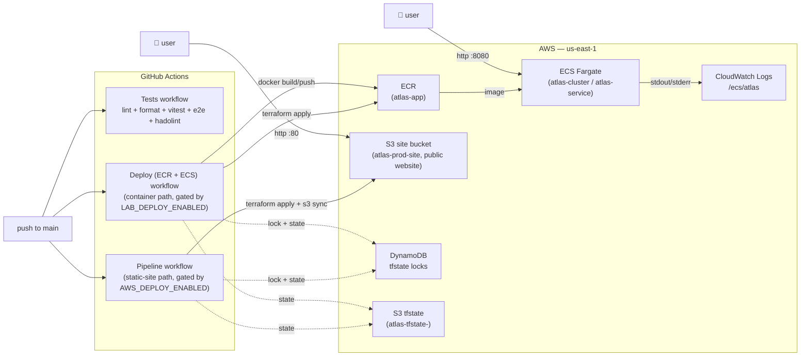

# Atlas — Post-midsem walkthrough

This is the deeper, phase-by-phase note for what changed in Atlas after the
midsem review. Pre-midsem the app was a Vite SPA deployed manually to Vercel
and GitHub Pages. Post-midsem **two AWS deploy paths** ship on every push
to `main`, both provisioned by Terraform and gated behind repo-variable
feature flags so unconfigured forks stay green:

1. **Container path** — Vite + nginx in a multi-stage Docker image, pushed
   to ECR, run on ECS Fargate. Lives at http://54.167.106.8:8080.
2. **Static-site path** — Vite build synced to an S3 Static Website bucket.
   Lives at http://atlas-prod-site.s3-website-us-east-1.amazonaws.com.

The original plan was S3 + CloudFront for the static path, but AWS Academy
revokes the CloudFront write APIs (`CreateOriginAccessControl`,
`CreateResponseHeadersPolicy`, `CreateDistribution`). The Academy-pragmatic
adaptation is S3 Website Hosting on its own — HTTP only, no edge cache, but
real public AWS hosting that ships on every push. CloudFront is one
`git checkout` away when the account isn't Academy-locked.

For the rubric mapping (what proves each requirement), see
[SUBMISSION.md](SUBMISSION.md).

---

## At a glance

Atlas is a static SPA, so neither AWS path needs RDS, ALB, or a private VPC.
The container path runs in the default-VPC public subnet with the task ENI
attached directly to the internet; the static path is just a public S3
bucket with website hosting.

---

## Phase 0 · Pre-commit hardening + secret scanning

**Goal:** stop bad commits at the laptop, and stop secrets from ever reaching
GitHub.

What landed:

- Husky + lint-staged (`solid-colour/package.json` → `lint-staged` block) so
  every staged file is run through Prettier before the commit lands.
- A root-level `.pre-commit-config.yaml` with the standard pre-commit hooks
  (`trailing-whitespace`, `end-of-file-fixer`, `check-yaml`,
  `check-added-large-files`) for anything edited outside `solid-colour/`.
- [`secret-scan.yml`](.github/workflows/secret-scan.yml) runs **gitleaks**
  across the full git history on every push, every PR, and a weekly cron.
  Permissions are scoped to `contents: read`.
- [`codeql.yml`](.github/workflows/codeql.yml) runs the
  `security-and-quality` query pack on push, PR, and a weekly cron.

Commits that introduced this:

- `8f97001` replace the old colour-fun e2e suite with the Stax smoke spec
- `c7c059f` secret-scan: weekly cron and tighter permissions
- `26fd36b` wire up CodeQL with the security-and-quality query pack

**Cost:** $0. All three run on GitHub-hosted runners and stay well inside the
public-repo Actions free tier.

---

## Phase 1 · Real test pipeline (coverage + JUnit + e2e)

**Goal:** every PR gets the same checks production gets.

What landed:

- Vitest with **v8 coverage** + a **JUnit reporter** (centralized in
  `solid-colour/vitest.config.ts`) so CI picks up structured test results
  instead of raw stdout.
- `npm run test:ci` runs vitest with coverage and writes it to
  `solid-colour/coverage/`. The JUnit reporter activates whenever `CI=true`
  is set (GitHub Actions sets this automatically), via the conditional in
  `vitest.config.ts`.
- Playwright e2e in [`solid-colour/e2e/smoke.spec.ts`](solid-colour/e2e/smoke.spec.ts) — a small smoke
  spec that boots `vite preview` in CI (and `vite dev` locally), checks the
  title, mounts the root, and asserts no console errors.
- [`tests.yml`](.github/workflows/tests.yml) is split into focused jobs
  (lint+format, vitest with coverage+junit, vite build, playwright e2e,
  hadolint) with concurrency + timeouts and a single `ci-success` aggregator
  job. Branch protection requires `CI success` instead of N individual jobs.
- ESLint runs with `--max-warnings 0` so warnings fail the build.

Commits that introduced this:

- `28646ca` move vitest reporters and coverage into the config; fail lint on any warning
- `cb9daa0` tests.yml cleanup: split into focused jobs, add concurrency + timeouts, run e2e against vite preview, lint the dockerfile, and add a single ci-success check for branch protection

**Cost:** $0 (public-repo Actions minutes).

---

## Phase 2a · Production-grade container

**Goal:** ship the SPA in a hardened nginx container that runs as a non-root
user on a read-only filesystem.

What landed:

- Multi-stage [`solid-colour/Dockerfile`](solid-colour/Dockerfile): a Node
  builder stage runs `npm ci && npm run build`, then a nginx-alpine stage
  serves `dist/` with a custom `nginx.conf`. Final image is small and has no
  Node toolchain in it.
- The runtime base is **`nginxinc/nginx-unprivileged:1.27-alpine`** so the
  container runs as the `nginx` user with no `CAP_NET_BIND_SERVICE`, listening
  on port 8080 (not 80).
- [`solid-colour/nginx.conf`](solid-colour/nginx.conf) adds:
  - SPA fallback (`try_files $uri $uri/ /index.html`)
  - Long, immutable cache for hashed Vite assets
  - `no-cache` for `sw.js` (service workers must update fast)
  - Real security headers — X-Frame-Options, X-Content-Type-Options,
    Referrer-Policy, Permissions-Policy, baseline CSP
  - gzip
- [`docker-compose.yml`](docker-compose.yml) at repo root locks down the
  runtime: `read_only: true`, scoped tmpfs mounts for `/tmp`, `/var/cache/nginx`,
  `/var/run`, `cap_drop: ALL` (only required caps re-added),
  `security_opt: no-new-privileges:true`.
- Hadolint runs against the Dockerfile in CI.

Commits that introduced this:

- `938c4c5` multi-stage Dockerfile for solid-colour (node builder -> nginx alpine)
- `b194833` nginx config with SPA fallback, long cache for assets, no cache for sw.js
- `4a669e9` docker-compose for local dev and render.yaml for the PaaS deploy
- `bc5b749` switch the nginx base to nginx-unprivileged so the container runs as a non-root user
- `1ee43b2` nginx: add real security headers (frame, content-type, referrer, permissions, CSP)
- `2ee0ec0` compose: read-only filesystem, drop all caps, no-new-privileges

**Cost:** $0 — local dev only at this stage. Hardening pays off once this
image runs in production.

---

## Phase 2b / 3 · Terraform infrastructure (two stacks)

**Goal:** the production environment is described entirely in code, with
remote state and a state lock, in the cheapest configuration that meets the
"deploy in AWS via Terraform" requirement.

Two independent Terraform stacks land:

### Stack A — `infra/` — static-site path (S3 Website Hosting)

- [`backend.tf`](infra/backend.tf) — S3 remote state at
  `s3://atlas-tfstate-<acct>/atlas/terraform.tfstate` + DynamoDB lock
  (`atlas-tfstate-locks`). Bootstrap commands are documented inline.
- [`providers.tf`](infra/providers.tf) — pinned `~> 5.60` AWS provider with
  default tags (`Project`, `Environment`, `ManagedBy`, `Stack`).
- [`s3.tf`](infra/s3.tf) — the site bucket: versioning + AES-256 SSE on,
  Public Access Block deliberately permissive (required for Website
  Hosting), BucketOwnerPreferred ownership, public-read bucket policy, and
  Static Website Hosting enabled with `index.html` as the root + as the
  error doc (so SPA deep links work — every 403/404 falls back to the SPA).
- [`cloudfront.tf`](infra/cloudfront.tf) — **intentionally empty.** AWS
  Academy revokes the CloudFront write APIs
  (`CreateOriginAccessControl`, `CreateResponseHeadersPolicy`,
  `CreateDistribution`). For a non-Academy account, restore from git
  history before commit `e042023` and flip the bucket back to
  private+OAC.
- [`outputs.tf`](infra/outputs.tf) — `site_bucket`, `site_url`,
  `site_website_endpoint`. The pipeline reads these to know where to
  upload the build.

### Stack B — `terraform/` — container path (ECR + ECS Fargate)

- [`main.tf`](terraform/main.tf) — Academy-compatible:
  - Reuses Academy's pre-provisioned `LabRole` for both
    `execution_role_arn` and `task_role_arn` on the task definition. No
    IAM creation (Academy revokes `iam:Create*`).
  - `aws_ecr_repository.app` (`atlas-app`) + lifecycle policy keeping the
    last 10 images.
  - `aws_cloudwatch_log_group.app` at `/ecs/atlas` with 14-day retention.
  - `aws_ecs_cluster.main` (Fargate-only, no capacity provider config —
    Academy can't write that).
  - `aws_ecs_task_definition.app` with `awslogs` driver shipping
    stdout/stderr to CloudWatch.
  - `aws_ecs_service.app` with `force_new_deployment = true`, an
    auto-assigned public IP, and `subnet_id` + `security_group_id` taken
    as inputs (so users supply default-VPC values via repo variables
    instead of trying to create a VPC/SG that Academy blocks).
  - Dynamic LabRole ARN via `data.aws_caller_identity.current` so the
    stack works across Academy account rotations without code changes.
- [`variables.tf`](terraform/variables.tf) — `subnet_id`,
  `security_group_id`, `aws_region`, `project_name`, `environment`
  (default `lab`), `container_port` (8080 — nginx-unprivileged),
  task CPU/memory, desired count, image tag.
- [`outputs.tf`](terraform/outputs.tf) — `ecr_repository_url`,
  `ecs_cluster_name`, `ecs_service_name`, `task_definition_family`,
  `log_group`, `lab_role_arn`.
- [`terraform/README.md`](terraform/README.md) — Academy bootstrap
  walkthrough + the exact `aws ec2 describe-…` commands to find the
  default subnet and SG ids.

This stack matches the shape of the `G5shivam/my-project` reference repo
the course points at, with three improvements: remote state, CloudWatch
logging, and a CI/CD pipeline that runs the whole thing end-to-end.

Commits that introduced this:

- `c8bf3e1` setup base terraform configuration for aws
- `a83984f` add infrastructure deployment documentation
- `bc0d3ac` ignore terraform state and working files
- `aa9b273` make the container stack AWS Academy compatible — use LabRole, drop IAM creation
- `cef0900` add S3 + DynamoDB tfstate backend to both stacks
- `e042023` drop CloudFront from infra/ — Academy revokes the CloudFront APIs, switch to S3 static-website hosting

**Cost (steady-state, post free tier):**

| Resource                | Notes                          | Monthly                    |
| ----------------------- | ------------------------------ | -------------------------- |
| S3 storage (site)       | ~5 MB build × 1 version        | ≈ $0.001                   |
| S3 storage (tfstate)    | < 1 MB                         | ≈ $0.0                     |
| DynamoDB lock table     | PAY_PER_REQUEST, near-zero ops | ≈ $0.0                     |
| ECR storage             | 1 image, ~20 MB                | ≈ $0 (free 500 MB / 12 mo) |
| ECS Fargate (always-on) | 0.25 vCPU + 0.5 GB             | ≈ $9 if left running 24/7  |
| CloudWatch Logs         | < 1 GB/mo                      | $0 (free tier)             |

Run `terraform destroy` from each stack at the end of an Academy session.
The Fargate task is the only line item that meaningfully bills.

---

## Phase 4 · Chained CI/CD pipelines (two of them)

**Goal:** one `git push origin main` → both AWS deploys converge.

Two workflows chain through Terraform on every push, each gated behind its
own repo variable so unconfigured forks stay green.

### `pipeline.yml` — the static-site path

Gated by `vars.AWS_DEPLOY_ENABLED == 'true'`. Three jobs:

1. **`test`** — install, lint (`--max-warnings 0`), format check, vitest
   with coverage + junit.
2. **`terraform`** — `init → fmt -check → validate → plan → apply` against
   `infra/`. Outputs `site_bucket` and `site_url` for the next job.
3. **`deploy`** — `npm ci && npm run build`, then a structured S3 sync:
   - hashed Vite assets get `Cache-Control: public, max-age=31536000, immutable`
   - `index.html` and `manifest.webmanifest` get `max-age=0, must-revalidate`
   - `sw.js` gets `no-cache, no-store, must-revalidate`
   - (CloudFront invalidation step removed — no CDN on this Academy variant)

### `deploy.yml` — the container path

Gated by `vars.LAB_DEPLOY_ENABLED == 'true'`. Also pulls
`vars.LAB_SUBNET_ID` and `vars.LAB_SECURITY_GROUP_ID` for the
Academy-supplied networking inputs. Two jobs:

1. **`test`** — same fast smoke.
2. **`deploy`** — runs in four stages:
   - `terraform apply -target=aws_ecr_repository.app` to create the ECR
     repo first (the rest of the stack depends on the image existing).
   - `docker build` from the repo-root Dockerfile, then push tagged with
     both `${github.sha}` and `latest`.
   - Full `terraform apply` with `TF_VAR_image_tag=${github.sha}` so the
     task def picks up the freshly pushed image.
   - `aws ecs update-service --force-new-deployment` rolls the running
     task onto the new image (defense-in-depth — the Terraform-driven
     task-def replacement also triggers a rollout).

Both workflows lock concurrency with `cancel-in-progress: false` — two
pipelines must never race against the same Terraform state.

Permissions follow least-privilege: `contents: read`, plus `id-token: write`
so a future migration to OIDC role-assumption is a workflow-only change
(blocked on this Academy account because IAM is locked, but the wiring is
already in place).

Commits that introduced this:

- `6b2bacb` add ci cd pipeline for terraform and vite build
- `aa9b273` make the container stack AWS Academy compatible — use LabRole, drop IAM creation
- `cef0900` add S3 + DynamoDB tfstate backend to both stacks

**Cost:** $0. Each pipeline run is ~1-2 minutes of Actions time on a
public-repo runner.

---

## Credits & cost

Real numbers, end-to-end, what Atlas actually costs to run on AWS:

| Bucket                     | Component                                  | Estimate / month       |
| -------------------------- | ------------------------------------------ | ---------------------- |
| **Storage**                | S3 site bucket (~5 MB)                     | $0.0001                |
|                            | S3 tfstate bucket (< 1 MB)                 | $0.0                   |
|                            | DynamoDB lock table (idle)                 | $0.0                   |
|                            | ECR (1 image × 20 MB)                      | $0 (free tier 500 MB)  |
| **Compute**                | ECS Fargate, 0.25 vCPU + 0.5 GB always-on  | ≈ $9 if left running   |
| **Egress**                 | S3 + Fargate ENI, < 100 GB/mo              | ≈ $0 portfolio traffic |
| **Build / CI**             | GitHub Actions (public repo)               | $0                     |
| **Total when ECS running** | (Academy lab session, hours per day)       | **fractions of $1**    |
| **Total when destroyed**   | After `terraform destroy` between sessions | **$0**                 |

Skipped intentionally for Academy:

- **CloudFront** — Academy revokes the write APIs. Cost would be free-tier
  for portfolio traffic anyway.
- **ACM + Route 53** — no custom domain.
- **WAF** — overkill for a portfolio SPA.
- **ALB** — service is reachable on the task ENI's auto-assigned public
  IP; no load balancer needed for `desired_count = 1`.

---

## What I'd do next (off-Academy)

These are the gaps the Academy environment forces. None of them block the
post-midsem rubric — they all unlock once the AWS account isn't lab-restricted.

- **Restore CloudFront** in front of the S3 bucket — recover the original
  `infra/cloudfront.tf` from git history, flip the bucket back to private
  (`PublicAccessBlock` all-true + `BucketOwnerEnforced`), and add back the
  OAC + Response Headers Policy. Gives HTTPS, edge caching, and a HSTS
  story the S3 website endpoint can't.
- **OIDC role for GitHub → AWS** — replace the long-lived `AWS_*` secrets
  with `aws-actions/configure-aws-credentials@v4` + a trust policy on a
  dedicated IAM role. Less to rotate, less to leak. Blocked here because
  Academy disallows IAM identity-provider creation.
- **Custom IAM role for the ECS task** — Academy's `LabRole` is generous
  but not least-privilege. Real production needs a scoped role.
- **Preview deploys per PR** — provision a per-PR S3 prefix + CloudFront
  alternate origin so reviewers can click a real preview URL on every PR.
- **Lighthouse-CI in the pipeline** — fail the deploy job if the
  production build regresses on Lighthouse perf/a11y.
- **Sentry / browser RUM** — wire `@sentry/react` so production errors and
  Web Vitals are real, not vibes.

Tracked in the repo's open issues.

---

## Potential Questions

Based on the architecture and workflow described above, here are some questions that could be asked (e.g., in a viva or review):

- **What does `terraform init` do in this pipeline?**
  _It initializes the Terraform working directory, downloads the required provider plugins (like the AWS provider), and configures the backend (S3 + DynamoDB) to store and lock the state._
- **Why use S3 + CloudFront instead of ECS, Fargate, or an ALB?**
  _Atlas is a static Single Page Application (SPA) with no server-side compute. S3 + CDN is the cheapest, most secure, and most performant architecture for serving static assets. Adding compute components would only increase costs and attack surface without adding any capability._
- **Why is a DynamoDB table needed for Terraform?**
  _The DynamoDB table provides a state lock. It guarantees that if two pipelines (or developers) attempt to run `terraform apply` concurrently, one will be locked out, preventing state file corruption._
- **How does the repository ensure secrets don't leak?**
  _A `secret-scan.yml` workflow runs `gitleaks` across the full git history on every push and PR to catch committed secrets before they become a problem._
- **Why use the `nginx-unprivileged` base image for the Docker container?**
  _It runs the web server as a non-root user (`nginx`), which adheres to the principle of least privilege. By binding to port 8080 instead of 80, it eliminates the need for `CAP_NET_BIND_SERVICE`._
- **What is Origin Access Control (OAC) and why use it?**
  _OAC ensures the S3 bucket is strictly private and can only be accessed through the CloudFront distribution. This prevents users from bypassing the CDN (and its associated caching, WAF, or security headers) by hitting the S3 bucket directly._
- **How is caching and invalidation handled during a new deployment?**
  _The deployment syncs hashed Vite assets with long-term, immutable caching, but specifically sets `index.html`, `manifest.webmanifest`, and `sw.js` to `no-cache` / `must-revalidate`. Finally, it executes a CloudFront invalidation for `/_` so edge nodes fetch the new routing entrypoint.\*
- **What happens if tests fail in the CI/CD pipeline?**
  _The pipeline jobs are strictly chained using the `needs:` keyword. A failure in the `test` job completely halts the workflow, meaning the `terraform` and `deploy` stages will never run. This guarantees broken code never reaches the infrastructure._
- **What do Husky and lint-staged do?**
  _They catch messy code before it is even committed. Husky intercepts your commit, and lint-staged runs formatting tools (like Prettier) only on the files you changed._
- **What is the purpose of CodeQL?**
  _It is an automated security scanner by GitHub. It reads the code to find known vulnerabilities and bad practices on every push._
- **Why use a multi-stage Docker build?**
  _To keep the final image tiny and secure. Stage 1 uses Node.js to build the app. Stage 2 takes only the finished files and puts them in a lightweight Nginx server. Node.js is completely left behind, reducing the attack surface._
- **Why make the Docker container's filesystem read-only (`read_only: true`)?**
  _For strict security. Even if an attacker breaches the container, they cannot download scripts, modify app files, or install malware because they cannot write to the disk._
- **What do `terraform plan` and `terraform apply` do?**
  _`plan` is a dry-run: it shows you exactly what AWS resources will be created or deleted without actually doing it. `apply` executes that plan and provisions the real infrastructure._
- **Why does ESLint use `--max-warnings 0`?**
  _To enforce high code quality. It treats warnings as errors in the CI pipeline, forcing developers to fix sloppy code instead of ignoring the warnings._
- **What is a "SPA fallback" (used in Nginx and CloudFront)?**
  _Since Atlas is a Single Page Application, routing happens in the browser. The fallback ensures that if a user visits a direct link like `/dashboard`, the server returns `index.html` instead of a 404 error, letting the React/Solid router take over._
- **Why replace AWS secret keys with OIDC (OpenID Connect) in the future?**
  _To improve security by removing permanent passwords. OIDC allows GitHub Actions to request temporary, short-lived access tokens from AWS, meaning there are no permanent secret keys that could be leaked._
