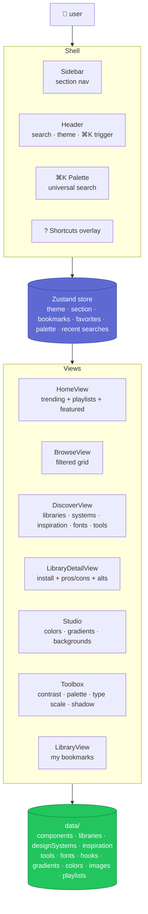
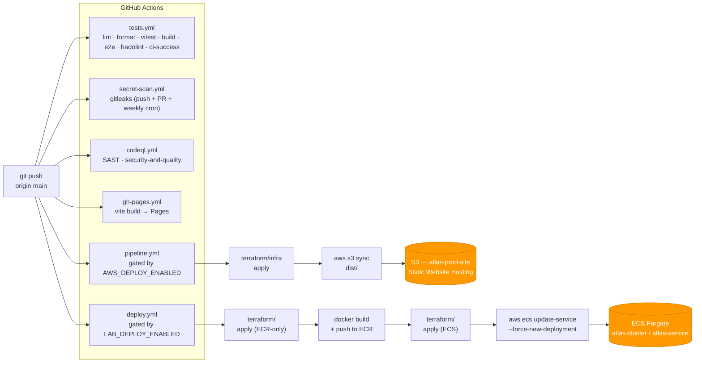

<div align="center">

# Atlas

**Every design resource a developer or designer ever needs, in one place.**

[](https://github.com/Adi-gitX/colour-fun/actions/workflows/tests.yml)
[](https://github.com/Adi-gitX/colour-fun/actions/workflows/pipeline.yml)
[](https://github.com/Adi-gitX/colour-fun/actions/workflows/deploy.yml)
[](https://github.com/Adi-gitX/colour-fun/actions/workflows/secret-scan.yml)
[](https://github.com/Adi-gitX/colour-fun/actions/workflows/codeql.yml)

</div>

The web has scattered design resources across thousands of disconnected sites — Awwwards for inspiration, shadcn for components, Coolors for palettes, Lucide for icons, Mobbin for mobile UI, Dribbble for trends. Atlas pulls every category that matters into one curated, searchable, opinionated library. One tab. Everything.

> [!TIP]
> **Try it →** ⌘K from anywhere fans search across libraries, design systems, components, colors, fonts, hooks, inspiration sites, and tools. Press `?` for the keyboard shortcut cheat sheet.

---

## Live deploys

| Channel               | URL                                                       | Behind                                             |
| --------------------- | --------------------------------------------------------- | -------------------------------------------------- |
| **AWS — ECS Fargate** | http://54.167.106.8:8080                                  | Multi-stage Docker → ECR → ECS Fargate (Terraform) |
| **AWS — S3 site**     | http://atlas-prod-site.s3-website-us-east-1.amazonaws.com | Vite build → S3 Static Website Hosting (Terraform) |
| Vercel                | https://colour-fun.vercel.app                             | Vite build → Vercel CDN                            |
| GitHub Pages          | https://adi-gitx.github.io/colour-fun/                    | Vite build → Pages                                 |

Both AWS channels are provisioned by Terraform under [`infra/`](infra/) and [`terraform/`](terraform/) and ship on every push to `main` via [`pipeline.yml`](.github/workflows/pipeline.yml) and [`deploy.yml`](.github/workflows/deploy.yml). State lives in `s3://atlas-tfstate-<account>/` with DynamoDB locking via `atlas-tfstate-locks`.

---

## What's inside

Atlas indexes resources across nine categories. Every entry is tagged, searchable, and one click from its source.

| Category                | Examples                                                                                                     |
| ----------------------- | ------------------------------------------------------------------------------------------------------------ |
| **Component libraries** | shadcn/ui · Radix · MUI · Mantine · Chakra · Headless UI · Park UI · Ariakit · Tremor · 25+ more             |
| **Design systems**      | Material 3 · Apple HIG · Polaris · Atlassian · Carbon · Fluent · Lightning · Primer · Spectrum · 17 more     |
| **UI inspiration**      | Awwwards · Mobbin · Land-book · SaaS Landing Pages · Page Flows · Typewolf · Refero · Codrops · 20+ more     |
| **Components & blocks** | 50+ real OSS UI projects with GitHub stars, install snippets, pros/cons, and alternatives                    |
| **Solid backgrounds**   | 238 hand-picked color tones — exportable at 1080p, 4K, or custom dimensions in PNG / JPEG / WebP             |
| **Gradients**           | 90 named presets across Sunset / Ocean / Forest / Pastel / Vivid / Mono / Mesh / Neon, plus a live generator |
| **Fonts & typography**  | 44 typefaces — Google Fonts curated, Fontshare open-tier, JetBrains / Geist / IBM Plex monos                 |
| **React hooks**         | 46 hooks from `react-use`, `usehooks-ts`, TanStack Query, and the Mantine team — copy-paste install ready    |
| **Toolbox utilities**   | In-app contrast checker · palette generator · type scale · shadow generator                                  |

Plus 84 stock backgrounds, embedded interactive tools, ⌘K palette, keyboard shortcuts, bookmarks + collections, and curated playlists ("SaaS launch stack", "Build a dashboard people actually use", "Free alternatives to MUI").

---

## Architecture



Single-page app, single-store state, single source of truth in `src/data/*.ts`. Search is fanned out across every data file by [`useUniversalSearch`](solid-colour/src/hooks/useUniversalSearch.ts) using Fuse.js — title weighted 3× over haystack, capped per category.

---

## CI / CD

Push to `main` triggers up to five workflows in parallel. The two AWS deploys are gated behind feature flags so unconfigured forks stay green.



Concurrency locks prevent two pipelines racing the same Terraform state. Workflow permissions are `contents: read` baseline plus `id-token: write` for future OIDC. The `tests.yml` pipeline finishes a full lint+test+build+e2e+hadolint cycle in **~1m40s** on a public-repo runner.

---

## Tech stack

| Layer                    | Choice                                                                       |
| ------------------------ | ---------------------------------------------------------------------------- |
| Framework                | React 19 + TypeScript 5.9                                                    |
| Build                    | Vite 7                                                                       |
| State                    | Zustand                                                                      |
| Styling                  | CSS Modules                                                                  |
| Animations               | Framer Motion                                                                |
| Search                   | Fuse.js (title weighted 3×, ranked across every data file)                   |
| Command palette          | cmdk (Vercel)                                                                |
| PWA                      | Vite PWA Plugin (offline-first)                                              |
| Unit / integration tests | Vitest + React Testing Library                                               |
| E2E                      | Playwright (production-preview build)                                        |
| Lint                     | ESLint 9 (flat config), `--max-warnings 0`                                   |
| Format                   | Prettier with husky + lint-staged                                            |
| Container                | Multi-stage Docker → `nginxinc/nginx-unprivileged:1.27-alpine`               |
| AWS — static site        | Terraform: S3 + Static Website Hosting (`infra/`)                            |
| AWS — container          | Terraform: ECR + ECS Fargate, ECS task uses Academy `LabRole` (`terraform/`) |
| State backend            | S3 (`atlas-tfstate-<account>`) + DynamoDB lock table (`atlas-tfstate-locks`) |
| CI                       | GitHub Actions with concurrency, timeouts, hadolint, `ci-success` aggregator |
| Security                 | gitleaks · CodeQL (security-and-quality) · dependabot auto-merge             |

For the full product spec — vision, JTBD, principles, success metrics — see [`PRD.md`](PRD.md).

---

## Repository

```
.
├── .github/
│   ├── dependabot.yml
│   ├── ISSUE_TEMPLATE/
│   ├── PULL_REQUEST_TEMPLATE.md
│   └── workflows/
│       ├── tests.yml                  # lint · test · build · e2e · hadolint · ci-success
│       ├── pipeline.yml                # AWS S3 static-site path (gated)
│       ├── deploy.yml                  # AWS ECR + ECS Fargate path (gated)
│       ├── secret-scan.yml             # gitleaks
│       ├── codeql.yml                  # SAST
│       ├── gh-pages.yml                # GitHub Pages
│       └── dependabot-auto-merge.yml   # safe-bump auto-merge
│
├── solid-colour/                       # the Vite + React frontend
│   ├── src/
│   │   ├── components/                 # Header · Sidebar · CommandPalette · ShortcutsOverlay · …
│   │   ├── components/views/           # HomeView · BrowseView · DiscoverView · LibraryView · LibraryDetailView · FontsView · HooksView
│   │   ├── components/tools/           # ContrastChecker · PaletteGenerator · TypeScale · ShadowGenerator
│   │   ├── data/                       # components · libraries · designSystems · inspiration · tools · fonts · hooks · gradients · colors · images · playlists
│   │   ├── hooks/useUniversalSearch.ts # Fuse.js fan-out across every data file
│   │   ├── store/appStore.ts           # single Zustand store, persisted
│   │   └── utils/                      # colorUtils · imageGenerator
│   ├── e2e/smoke.spec.ts               # Playwright smoke
│   ├── Dockerfile                      # multi-stage, non-root nginx
│   ├── nginx.conf                      # SPA fallback, security headers, gzip
│   ├── vitest.config.ts
│   └── playwright.config.ts
│
├── infra/                              # Terraform — S3 Static Website (AWS)
├── terraform/                          # Terraform — ECR + ECS Fargate (AWS)
├── Dockerfile                          # repo-root container (used by deploy.yml)
├── docker-compose.yml                  # locked-down local runtime
├── render.yaml                         # PaaS deploy
├── scripts/scrape-awesome.ts           # devtool — re-seed catalogs from awesome-lists
├── PRD.md                              # full product spec
└── README.md
```

---

## Quickstart

```bash
git clone git@github.com:Adi-gitX/colour-fun.git atlas
cd atlas
npm install                            # root: husky, lint-staged, prettier
npm install --prefix solid-colour      # frontend deps
npm run dev --prefix solid-colour      # → http://localhost:5173
```

### Container

```bash
docker compose up --build              # → http://localhost:8080
```

The image runs as the non-root `nginx` user, on a read-only filesystem, with all Linux capabilities dropped except those nginx workers strictly need.

### Frontend scripts (in `solid-colour/`)

| Script                 | What it does                                                       |
| ---------------------- | ------------------------------------------------------------------ |
| `npm run dev`          | Vite dev server with HMR                                           |
| `npm run build`        | TypeScript check + production Vite build                           |
| `npm run preview`      | Serve the production build locally                                 |
| `npm test`             | Vitest                                                             |
| `npm run test:ci`      | Vitest with v8 coverage + JUnit (`CI=true` enables JUnit reporter) |
| `npm run test:e2e`     | Playwright e2e (boots `vite preview` in CI, `vite dev` locally)    |
| `npm run lint`         | ESLint with `--max-warnings 0`                                     |
| `npm run format`       | Prettier write                                                     |
| `npm run format:check` | Prettier check                                                     |

---

## Deploying to AWS

Both Terraform stacks are independent. Apply either or both.

### Static-site path → S3 Website

```bash
cd infra
terraform init
terraform plan
terraform apply                # provisions atlas-prod-site bucket + website
```

Output: `terraform output site_url`.

### Container path → ECS Fargate

```bash
cd terraform
cat > terraform.tfvars <<EOF
subnet_id         = "subnet-xxxxxxxx"   # any default-VPC public subnet
security_group_id = "sg-yyyyyyyy"        # SG with TCP:8080 inbound rule
EOF
terraform init
terraform apply                # provisions ECR + ECS cluster + service
```

Output: `terraform output ecr_repository_url`, `terraform output ecs_service_name`.

### CI takes over from there

Push to `main` with the right repo variables and secrets set, and both pipelines roll the live deploys without a laptop in the loop. Step-by-step bootstrap is in [`infra/README.md`](infra/README.md) and [`terraform/README.md`](terraform/README.md).

---

## Security posture

- **Non-root container** — `nginxinc/nginx-unprivileged:1.27-alpine`, port 8080, no `CAP_NET_BIND`
- **Hardened `docker-compose.yml`** — `read_only: true`, scoped tmpfs, `cap_drop: ALL`, `no-new-privileges`
- **Real security headers** — X-Frame-Options · X-Content-Type-Options · Referrer-Policy · Permissions-Policy · baseline CSP
- **Pre-commit secret blocking** — gitleaks runs on every push and weekly cron
- **CodeQL** with the `security-and-quality` query pack
- **Pinned base image** — nginx pinned to a minor (`1.27`), not `:alpine`
- **`.npmrc` gitignored** — auth tokens never reach the repo
- **Workflow least-privilege** — `contents: read` baseline plus `id-token: write` only where a future OIDC migration needs it

---

## Contributing

PRs welcome. Run the local CI dry-run before opening one:

```bash
cd solid-colour
npm run lint                # eslint --max-warnings 0
npm run format:check        # prettier
CI=true npm run test:ci     # vitest + coverage + junit
npm run build               # vite build
npm run test:e2e            # playwright
```

The PR template walks through the checklist. Dependabot auto-merge handles patch + dev-dep minor bumps.

---

## License

MIT
