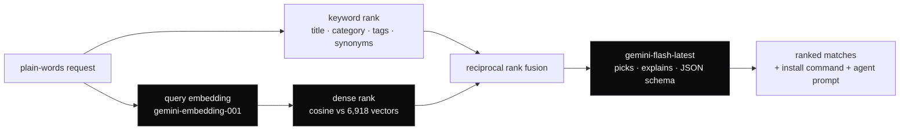

<div align="center">

<picture>
  <source media="(prefers-color-scheme: dark)" srcset=".github/assets/wordmark-dark.svg">
  <source media="(prefers-color-scheme: light)" srcset=".github/assets/wordmark-light.svg">
  
</picture>

<br>

**Describe the component. Get the install command.**

[](https://github.com/Adi-gitX/colour-fun/actions/workflows/tests.yml)
[](https://github.com/Adi-gitX/colour-fun/actions/workflows/pipeline.yml)
[](https://github.com/Adi-gitX/colour-fun/actions/workflows/secret-scan.yml)
[](https://github.com/Adi-gitX/colour-fun/actions/workflows/codeql.yml)

</div>

---

Finding a React component means opening a dozen registry sites and reading a dozen docs pages. Garden indexes **6,918 components across 52 open-source libraries** and answers in the other direction: say what you need in plain words, get back the one-line install command for the closest match.

Every result installs from its own library and keeps its own licence and author. Garden re-hosts nothing.

```
"a loader for a checkout page"     →  npx shadcn@latest add "https://…/dotm-square-3.json"
"a hero with an aurora background" →  npx shadcn@latest add "https://…/aurora-background.json"
```

---

## How the finder works

Retrieval runs two independent rankings and fuses them, then a model picks and explains. Each stage degrades to the one below it, so the app answers with no key, no network and no model.


```mermaid
flowchart LR
    q["plain-words request"] --> kw["keyword rank<br/>title · category · tags · synonyms"]
    q --> emb["query embedding<br/>gemini-embedding-001"]
    emb --> dense["dense rank<br/>cosine vs 6,918 vectors"]
    kw --> rrf["reciprocal rank fusion"]
    dense --> rrf
    rrf --> rank["gemini-flash-latest<br/>picks · explains · JSON schema"]
    rank --> out["ranked matches<br/>+ install command + agent prompt"]

    classDef model fill:#0b0b0c,stroke:#3f3f46,color:#fafafa
    class emb,dense,rank model
```

- **Keyword ranking** always runs, in the browser, over the bundled index. Field-weighted with a synonym table, so "loader" also reaches spinner, skeleton and progress.
- **Dense ranking** compares the request against precomputed embeddings, quantised to `int8` at 256 dimensions so the whole catalogue ships as a ~1.7 MB binary and searches on device.
- **Fusion** is reciprocal rank, which merges the two lists by position and needs no weight tuning between incomparable scores.
- **Reranking** hands ~24 candidates to Gemini under a JSON schema. It never invents a slug; anything not in the candidate list is dropped.

Without a key the finder still returns fused or keyword results — it just loses the per-card explanations.

---

## Quickstart

```bash
git clone git@github.com:Adi-gitX/colour-fun.git garden
cd garden/solid-colour
npm install
npm run dev                # → http://localhost:5173
```

The index is committed, so the app is fully searchable straight after clone. No key, no backend, no ingest required.

### Optional: enable the model

```bash
cp .env.example .env       # then paste a Gemini key
npm run embed              # embeds the catalogue (resumable, cached by content hash)
```

| Variable              | Purpose                                                                 |
| --------------------- | ----------------------------------------------------------------------- |
| `GEMINI_API_KEY`      | Build-time only. Used by `npm run embed`; never shipped to the browser. |
| `VITE_GEMINI_API_KEY` | Development only. `VITE_`-prefixed values are compiled into the bundle. |
| `VITE_ATLAS_API_URL`  | Production. Points the app at the registry API, which holds the key.    |

> [!IMPORTANT]
> `VITE_` variables are public. For anything deployed, leave `VITE_GEMINI_API_KEY` empty and route through the API instead.

---

## Sections

| Section        | What it does                                                                                           |
| -------------- | ------------------------------------------------------------------------------------------------------ |
| **Ask**        | The finder. Plain-words request in, ranked components out, each with install, agent prompt and source. |
| **Libraries**  | All 104 known libraries, 52 of them indexed, with licence, author and a direct link.                   |
| **Wallpapers** | 238 solid colours, 90 gradients and 84 images, exportable to 8K in PNG, JPEG or WebP.                  |

⌘K opens universal search from anywhere; `?` shows the shortcut sheet.

---

## Design

Dark-first, built on a pure black ground with hairline `#0a0a0a` surfaces and a white-only accent. Type is two self-hosted faces from [freefaces.gallery](https://www.freefaces.gallery): **Martian Mono** (SIL OFL) for display and **Commit Mono** (MIT) for everything else. The identity is the 5×5 dot matrix — the mark, the wordmark above and the six loading states are all drawn from the same grid by [`scripts/gen-icons.mjs`](solid-colour/scripts/gen-icons.mjs), so they cannot drift apart.

---

## Data pipeline

Component data comes from a sibling repository, `atlas-registry`, which ingests every library's public registry. This repo holds the built artefacts, so the pipeline is only needed to refresh them.

```bash
npm run sync    # rebuild public/data/index.json + libraries.json from the registry
npm run embed   # re-embed anything whose text changed
```

`sync` exits without writing when the registry is absent, which is why `prebuild` can run it unconditionally — a CI or Vercel build with no sibling repo falls through to the committed index.

---

## Tech stack

| Layer     | Choice                                                       |
| --------- | ------------------------------------------------------------ |
| Framework | React 19 · TypeScript 5.9 · Vite 7                           |
| Styling   | Tailwind CSS 4 · CSS Modules · shadcn/ui primitives on Radix |
| State     | Zustand 5, persisted to `localStorage`                       |
| Motion    | Motion 13 / Framer Motion 12                                 |
| Offline   | `vite-plugin-pwa` (Workbox `generateSW`)                     |
| Testing   | Vitest 4 · Playwright · ESLint 9 · Prettier 3                |

---

## Repository

```
.
├── .github/
│   ├── assets/                         # dot-matrix wordmarks (generated)
│   └── workflows/
│       ├── tests.yml                   # lint · test · build · e2e · hadolint
│       ├── pipeline.yml                # AWS S3 static-site path (gated)
│       ├── deploy.yml                  # AWS ECR + ECS Fargate path (gated)
│       ├── secret-scan.yml             # gitleaks
│       ├── codeql.yml                  # SAST
│       └── gh-pages.yml                # GitHub Pages
│
├── solid-colour/                       # the Vite + React app
│   ├── public/
│   │   ├── data/index.json             # the committed component index
│   │   ├── previews/                   # rendered component previews
│   │   └── fonts/                      # Martian Mono · Commit Mono
│   ├── src/
│   │   ├── components/views/           # AskView · LibrariesView · WallpapersView
│   │   ├── components/brand/DotMark    # the 5×5 dot-matrix mark
│   │   ├── components/ui/              # shadcn primitives + dot-matrix loaders
│   │   ├── lib/ask/                    # retrieval · fusion · Gemini client
│   │   ├── store/appStore.ts           # single persisted Zustand store
│   │   └── data/                       # colours · gradients · images · libraries
│   ├── scripts/
│   │   ├── sync-registry.mjs           # registry → index.json
│   │   ├── embed-index.mjs             # index.json → embeddings.bin
│   │   └── gen-icons.mjs               # glyph → favicon · PWA icons · wordmark
│   ├── bin/                            # CodeCraft API launcher + protocol proxy
│   └── e2e/                            # Playwright specs
│
├── infra/                              # Terraform — S3 static website
├── terraform/                          # Terraform — ECR + ECS Fargate
└── docker-compose.yml                  # locked-down local runtime
```

---

## Scripts

Run from `solid-colour/`.

| Script             | What it does                                     |
| ------------------ | ------------------------------------------------ |
| `npm run dev`      | Vite dev server with HMR                         |
| `npm run build`    | TypeScript project build + production Vite build |
| `npm run preview`  | Serve the production build locally               |
| `npm test`         | Vitest                                           |
| `npm run test:ci`  | Vitest with v8 coverage + JUnit                  |
| `npm run test:e2e` | Playwright                                       |
| `npm run lint`     | ESLint, `--max-warnings 0`                       |
| `npm run sync`     | Rebuild the index from the registry, then embed  |
| `npm run embed`    | Embed the catalogue (resumable)                  |

---

## Deploys

| Channel               | URL                                                       | Behind                                             |
| --------------------- | --------------------------------------------------------- | -------------------------------------------------- |
| **Vercel**            | https://colour-fun.vercel.app                             | Vite build → Vercel CDN                            |
| **AWS — ECS Fargate** | http://54.167.106.8:8080                                  | Multi-stage Docker → ECR → ECS Fargate (Terraform) |
| **AWS — S3 site**     | http://atlas-prod-site.s3-website-us-east-1.amazonaws.com | Vite build → S3 Static Website Hosting (Terraform) |
| GitHub Pages          | https://adi-gitx.github.io/colour-fun/                    | Vite build → Pages                                 |

Both AWS channels are provisioned by Terraform under [`infra/`](infra/) and [`terraform/`](terraform/) and ship on every push to `main`, gated behind feature flags so unconfigured forks stay green. State lives in `s3://atlas-tfstate-<account>/` with DynamoDB locking.

Vercel builds from the `solid-colour` root directory; its install, build and output settings are pinned in [`solid-colour/vercel.json`](solid-colour/vercel.json) so the deploy does not depend on dashboard fields.

---

## Security

- `gitleaks` on every push, pull request and weekly cron
- CodeQL SAST on the `security-and-quality` suite
- Dependabot with auto-merge limited to safe bumps
- Container runs as non-root on a read-only filesystem with capabilities dropped
- No key ever reaches the browser in a production build

---

## Licence

MIT. Every indexed component keeps the licence and author of the library it comes from; Garden stores the pointer, never a copy.
